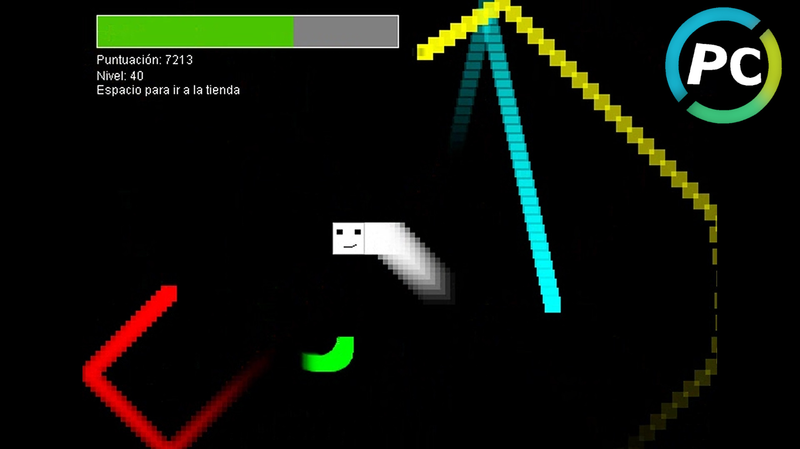

# Wave
Juego Clásico de Arcade
 Versión de PauloCodifica.
 Creado originalmente por RealTutsGML.

## [ Español ]
### ¿Qué es Wave?
Wave es un juego de estilo clásico de arcade en el que debes moverte rápidamente para evitar colisionar con los enemigos.
Para más información, visita: https://paulocodifica.github.io/es/games/Wave

### ¿Cómo se juega?
1. Descarga el archivo Wave.jar
2. Ejecútalo
3. ¡Diviértete!
 ( Nota: Debes tener JAVA instalado )

### Controles:
W, A, S, D para moverte.
 P para pausar partida.
 Barra Espaciadora para visitar tienda.

## [ English ]
### ¿What is Wave?
Wave is a classic arcade style game where you must move quickly to avoid colliding with enemies.
For more information, visit: https://paulocodifica.github.io/en/games/Wave

### ¿How to play?
1. Download the Wave.jar file
2. Run it
3. Have fun!
 ( PS: You must have JAVA installed )

### Controls:
W, A, S, D to move.
 P to pause game.
 Space Bar to visit store.
